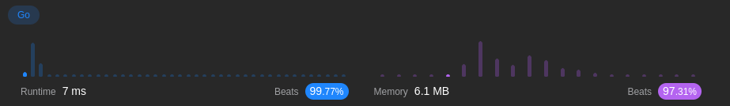
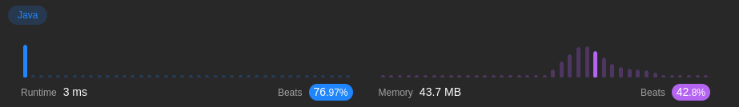
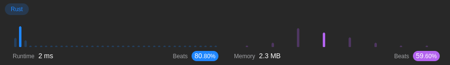
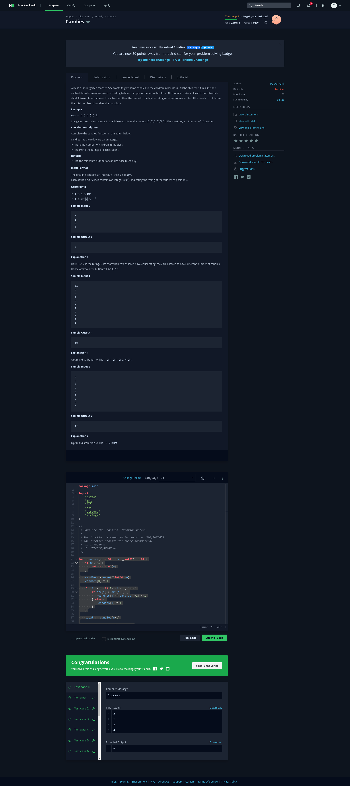

# Relatorio APA   
   
   
# Candies   
   
## qual o problema? 
   
**Instruções**:   
Alice é uma professora de jardim de infância. Ela quer dar alguns doces para as crianças de sua classe. Todas as crianças se sentam em uma fila, e cada uma delas tem uma pontuação de classificação de acordo com seu desempenho na classe. Alice quer dar pelo menos 1 doce para cada criança. Se duas crianças se sentam uma ao lado da outra, então aquela com a pontuação mais alta deve receber mais doces. Alice quer minimizar o número total de doces que ela precisa comprar.   
   
### Exemplo

Ela dá doces aos alunos nas seguintes quantidades mínimas: . Ela precisa comprar no mínimo 10 doces.   
   
### Descrição da Função

Complete a função candies no editor abaixo.

candies tem os seguintes parâmetros:

int n: o número de crianças na classe
int arr[n]: as classificações de cada aluno
Retorna

int: o número mínimo de doces que Alice deve comprar
Formato de Entrada

A primeira linha contém um número inteiro, , o tamanho de .
Cada uma das próximas linhas contém um número inteiro  indicando a classificação do aluno na posição .

   
## Linguagem para resolver o problemas:

   
Para resolver o problema utilzamos 3 linguagens diferentes:
   
1. Java   
2. Golang   
3. Rust   
   
   
Java e golang foram utilizadas pela familiaridade dos integrantes do grupo. A linguagem rust foi utilizada por demonstrar desempenho de execução e uso de memória

   
# Estratégia para Solução
   
   
   
1. Percorre vetor da esquerda para direita   
    - Vetor é percorrido começando do item 0 (esquerda) usando um loop `for`, o codigo deve verificar se a atual classificação lida é maior do que a anterior   
    - Quando a classificação atual é maior, a criança recebe um doce a mais que a criança anterior, quando não maior é dado apenas 1 doce   
    - A lógica acontece no primeiro loop do codigo    
   
       
   
2.  Percorre o vetor da direita pra esquerda   
  - Vetor é percorrido do último item para a esquerda usando loop `for`, dessa forma é garantido que a criança tenha tantos doces quanto a criança a direita com uma classficação maior   
  - é ajustado a quantidade de doces da criança atual para que seja o máximo entre o número atual de doces e o numéro de doces da criança a direita   
  - A lógica acontece no segundo loop do codigo   
   
   
- Antes de processar os loops, é verificado se o vetor tem tamanho menor ou igual a 1. Quando é verdadeiro, o próprio tamanho é retornado, já que não será preciso atribuir doces   
   
   
   
**Inicialização e Contagem Total**:   
- O algortimo inicaliza o vetor candies que armazena a quantidade de doces que é dada para cada criança   
- Usando a variável `total` fazemos a contagem de todos os doces que foram atribuidos que no fim é retornada como resultado final.    
   
**Utilização de Função Auxiliar** max   
- A função max faz o trabalho de calcular o máximo entre 2 numeros. Portanto, usamos para garantir que a quantidade destribuida seja feita corretamente durante passagem do vetor. Ela foi separada para manter o código mais legível.   
- No java é substituido um import equivalante: `Math.max`   
   
   
#    
   
```


func candy(ratings []int) int {
	// Define n como o tamanho do vetor
	n := len(ratings)

	// Log da entrada
	log.Printf("Classificações recebidas: %v", ratings)

	// Se o tamanho do vetor for menor ou igual a 1, retorna o próprio tamanho
	if n <= 1 {
		log.Printf("Apenas uma criança ou nenhum. Retornando %d como a quantidade total de doces.", n)
		return n
	}

	// Cria um vetor para armazenar a quantidade de doces atribuídos a cada criança
	candies := make([]int, n)

	// Atribui 1 doce à primeira criança
	candies[0] = 1

	// Loop para percorrer as classificações da esquerda para a direita
	for i := 1; i < n; i++ {
		// Se a classificação atual for maior que a anterior, atribui um doce a mais
		if ratings[i] > ratings[i-1] {
			candies[i] = candies[i-1] + 1
		} else {
			// Se não, atribui apenas 1 doce
			candies[i] = 1
		}
		// Log do número de doces atribuídos a cada criança durante o loop
		log.Printf("Criança %d recebeu %d doces", i, candies[i])
	}

	// Inicializa a variável total com a quantidade de doces da última criança
	total := candies[n-1]

	// Loop para percorrer as classificações da direita para a esquerda
	for i := n - 2; i >= 0; i-- {
		// Se o rating atual é maior que o próximo, ajusta para que tenha 1 a mais que o próximo
		if ratings[i] > ratings[i+1] {
			// Se a próxima criança tem mais doces, nada muda
			candies[i] = max(candies[i], candies[i+1]+1)
		}
		// Adiciona a quantidade de doces da criança atual ao total
		total += candies[i]
		// Log do número de doces atribuídos a cada criança durante o loop reverso
		log.Printf("Criança %d recebeu %d doces (total acumulado: %d)", i, candies[i], total)
	}

	// Log do resultado
	log.Printf("Quantidade total de doces atribuídos: %d", total)

	// Retorna a quantidade total de doces atribuídos
	return total
}

// Calcula o máximo entre dois inteiros
func max(a, b int) int {
	if a > b {
		return a
	}
	return b
}


```
## Imports   
   
```

import (
	"fmt"
	"log"
)

```
    

## Resultados em Go

Ao executar o algoritmo Candies utilizando a linguagem Go, os resultados obtidos foram os seguintes:

- **Tempo de Execução:** 7ms
- **Taxa de Desempenho:** 99.77%, comparada a outros algoritmos testados
- **Memória Utilizada:** 6.1MB
- **Taxa de Memória:** 97.31%, comparada a outros algoritmos testados

```
public class Candy {
    public int candy(int[] ratings) {
        // Obtém o tamanho do array
        int n = ratings.length;

        // Se o tamanho do array for menor ou igual a 1, retorna o próprio tamanho
        if (n <= 1) {
            return n;
        }

        // Cria um array para armazenar a quantidade de doces atribuídos a cada criança
        int[] candies = new int[n];
        
        // Atribui 1 doce à primeira criança
        candies[0] = 1;

        // Loop para percorrer as classificações da esquerda para a direita
        for (int i = 1; i < n; i++) {
            // Se a classificação atual for maior que a anterior, atribui um doce a mais
            if (ratings[i] > ratings[i - 1]) {
                candies[i] = candies[i - 1] + 1;
            } else {
                // Se não, atribui apenas 1 doce
                candies[i] = 1;
            }
        }

        // Inicializa a variável total com a quantidade de doces da última criança
        int total = candies[n - 1];

        // Loop para percorrer as classificações da direita para a esquerda
        for (int i = n - 2; i >= 0; i--) {
            // Se o rating atual é maior que o próximo, ajusta para que tenha 1 a mais que o próximo
            if (ratings[i] > ratings[i + 1]) {
                // Se a próxima criança tem mais doces, nada muda
                candies[i] = Math.max(candies[i], candies[i + 1] + 1);
            }
            // Adiciona a quantidade de doces da criança atual ao total
            total += candies[i];
        }

        // Retorna a quantidade total de doces atribuídos
        return total;
    }
}

```
    


## Resultados em Java

Durante a execução do algoritmo Candies utilizando Java, foram observados os seguintes resultados:

- **Tempo de Execução:** 3ms
- **Taxa de Desempenho:** 76.97%, comparada a outros algoritmos testados
- **Memória Utilizada:** 43.7MB
- **Taxa de Memória:** 42.8%, comparada a outros algoritmos testados
```

...
// Importa a biblioteca de logging do Rust
use log::{info, debug};

impl Solution {
    pub fn candy(ratings: Vec<i32>) -> i32 {
        // Inicializa o sistema de logging
        env_logger::init();

        // Obtém o tamanho do vetor
        let n = ratings.len();

        // Log da entrada
        debug!("Classificações recebidas: {:?}", ratings);

        // Se o tamanho do vetor for menor ou igual a 1, retorna o próprio tamanho
        if n <= 1 {
            info!("Apenas uma criança ou nenhum. Retornando {} como a quantidade total de doces.", n);
            return n as i32;
        }

        // Cria um vetor para armazenar a quantidade de doces atribuídos a cada criança
        let mut candies = vec![0; n];

        // Atribui 1 doce à primeira criança
        candies[0] = 1;

        // Loop para percorrer as classificações da esquerda para a direita
        for i in 1..n {
            // Se a classificação atual for maior que a anterior, atribui um doce a mais
            if ratings[i] > ratings[i - 1] {
                candies[i] = candies[i - 1] + 1;
            } else {
                // Se não, atribui apenas 1 doce
                candies[i] = 1;
            }
        }

        // Inicializa a variável total com a quantidade de doces da última criança
        let mut total = candies[n - 1];

        // Loop para percorrer as classificações da direita para a esquerda
        for i in (0..n - 1).rev() {
            // Se o rating atual é maior que o próximo, ajusta para que tenha 1 a mais que o próximo
            if ratings[i] > ratings[i + 1] {
                // Se a próxima criança tem mais doces, nada muda
                candies[i] = std::cmp::max(candies[i], candies[i + 1] + 1);
            }
            // Adiciona a quantidade de doces da criança atual ao total
            total += candies[i];
        }

        // Log do resultado
        info!("Quantidade total de doces atribuídos: {}", total);

        // Retorna a quantidade total de doces atribuídos
        total
    }
}

```
## Imports   
```
[dependencies]
env_logger = "0.12"
log = "0.4"

```


## Resultados em Rust

Ao executar o algoritmo Candies utilizando a linguagem Rust, os resultados foram os seguintes:

- **Tempo de Execução:** 2ms
- **Taxa de Desempenho:** 80.80%, comparada a outros algoritmos testados
- **Memória Utilizada:** 2.3MB
- **Taxa de Memória:** 59.60%, comparada a outros algoritmos testados
   
Os argumentos para resolver são um pouco diferentes do hackeRank, no hacker rank os argumento são um int n e um vetor, enquanto no leetcode existe apenas um argumento de entrada.    
   
algoritmo deve ser testado em máquinas diferentes (pelo menos duas), e o
tempo de execução deve ser analisado.   
 
# Como executar em cada linguagem
## Execução em go

Passo 1: Instalar o Go
1. Download:
	- Acesse o site oficial do Go e faça o download da versão mais recente do Go para o seu sistema operacional.
2. Instalação:
	- Siga as instruções de instalação fornecidas no site para o seu sistema operacional.
3. Configurar GOPATH (Opcional, mas recomendado para desenvolvimento):
	- Configure a variável de ambiente GOPATH para apontar para o diretório onde você deseja armazenar seus projetos Go. Adicione $GOPATH/bin ao seu PATH para que os executáveis sejam facilmente acessíveis.


Passo 2: Executar o Programa
1. Terminal:
	- Abra um terminal ou prompt de comando.
2. Navegar para o Diretório do Projeto:
	- Use o comando cd para navegar até o diretório onde seu arquivo Go está localizado.
3. Executar o Programa:
	- Execute o comando go run seguido do nome do seu arquivo Go:

```


go run main.go

```

## Execução em Rust

Instalar o Rust:
Certifique-se de que o Rust está instalado no seu sistema. Se ainda não estiver instalado, você pode instalá-lo executando o seguinte comando no terminal:

```
curl --proto '=https' --tlsv1.2 -sSf https://sh.rustup.rs | sh
```
Siga as instruções durante a instalação. Após a instalação, você pode precisar reiniciar o terminal ou executar o seguinte comando para atualizar as variáveis de ambiente:

```
source $HOME/.cargo/env
```
Criar um novo projeto:
Crie um novo projeto Rust usando o seguinte comando:


cargo new nome_do_projeto
Isso criará um diretório chamado nome_do_projeto contendo os arquivos padrão de um projeto Rust.

Copiar o código para o projeto:
Copie o código fornecido para o arquivo main.rs dentro do diretório do seu novo projeto. Substitua o conteúdo gerado automaticamente pelo Cargo pelo seu código.

Adicionar dependências ao Cargo.toml:
Abra o arquivo Cargo.toml e adicione as seguintes linhas para incluir as dependências necessárias (log, env_logger e sys_info):


```
[dependencies]
log = "0.4.14"
env_logger = "0.10.0"
sys-info = "0.15.0"
Compilar e Executar:
```
No terminal, navegue até o diretório do seu projeto e execute o seguinte comando para compilar e executar o código:

```
cargo run
```
Isso compilará o código e executará o programa. Os resultados e logs devem aparecer no terminal.


## Como Executar Java

## Como Usar

### Pré-requisitos

- Java Development Kit (JDK) instalado para compilar e executar o código.

### Execução do Projeto

1. Clone este repositório:

    ```bash
    git clone https://github.com/ARTHUR9011/CandyAPA.git
    ```

2. Acesse o diretório do projeto:

    ```bash
    cd CandyAPA
    ```

3. Compile os arquivos Java:

    ```bash
    javac Candy.java Main.java
    ```

4. Execute o programa:

    ```bash
    java Main
    ```

Isso executará o algoritmo de distribuição de doces com classificações de exemplo e exibirá o total de doces atribuídos.

### Personalização

- Modifique as classificações de exemplo em `Main.java` para testar o algoritmo com diferentes conjuntos de dados.
- Dentro do arquivo `Candy.java`, é possível ajustar a lógica de distribuição de doces para atender a diferentes critérios, se necessário.

## Detalhes da Implementação

- `Candy.java`: Contém a lógica para distribuir doces entre as crianças com base em suas classificações.
- `Main.java`: Classe com o método `main` para testar o algoritmo de distribuição de doces.
## Print do sucesso no hackerank
A função para candy no hacker precisa ser um pouco alterada, pois ela deve receber 2 argumentos: um vetor com as classificações e o número de alunos 

```
func candies(n int32, arr []int32) int64 {
    if n <= 1 {
        return int64(n)
    }

    candies := make([]int64, n)
    candies[0] = 1

    for i := int32(1); i < n; i++ {
        if arr[i] > arr[i-1] {
            candies[i] = candies[i-1] + 1
        } else {
            candies[i] = 1
        }
    }

    total := candies[n-1]

    for i := n - 2; i >= 0; i-- {
        if arr[i] > arr[i+1] {
            candies[i] = max64(candies[i], candies[i+1]+1)
        }
        total += candies[i]
    }

    return total
}

func max64(a, b int64) int64 {
    if a > b {
        return a
    }
    return b
}
```
   
